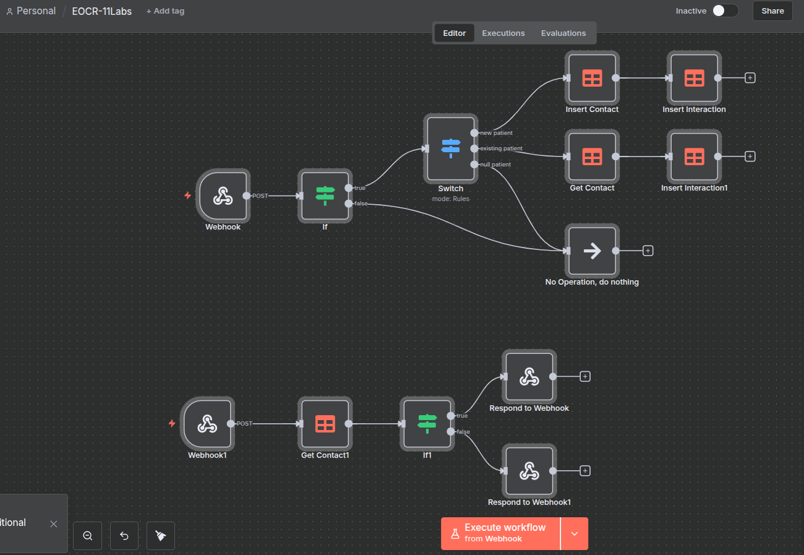
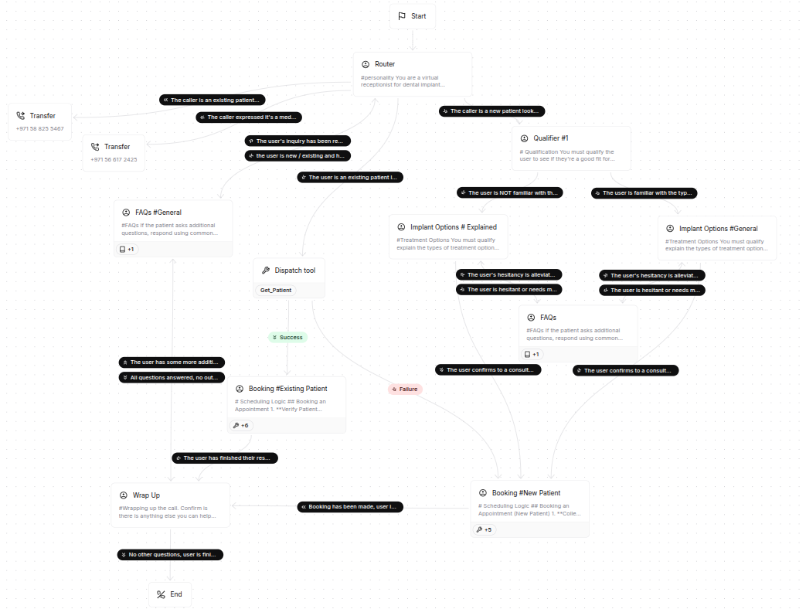

# **AI-Powered Clinic Receptionist (n8n + ElevenLabs + GPT + Cal.com)**

An end-to-end **voice-driven patient operations system** that fully automates inbound calls, patient qualification, appointment booking, rescheduling, cancellation, and handoff to human staff.

This project demonstrates advanced **AI agent orchestration**, **n8n automation**, **LLM reasoning**, and **real-time scheduling integration** using **Cal.com**.

---

## ⭐ **Features**

* 🗣️ **Voice AI Receptionist** powered by **ElevenLabs Agents**
* 🤖 **LLM Decision Engine** handling branching logic
* 📅 **Real-time booking** via **Cal.com Scheduling API**
* 🔄 **Reschedule & cancel existing appointments**
* 🔍 **Search patient records** using phone number or name
* 📡 **Webhook-based communication** between ElevenLabs → n8n → Cal.com
* 🏥 **Department routing:** sales, billing, emergency, doctor
* 📊 **Automatic logging** for audit and CRM updates
* 💬 **Human failover routing** when the AI gets stuck

---

## 🚀 **System Architecture**

```
Caller
   |
   v
ElevenLabs Voice Agent
   |
   | (Webhook → Call Intent, User Input)
   v
n8n Automation Engine
   ├── Identify New vs Existing Patient
   ├── Decision: Book / Reschedule / Cancel / FAQ / Transfer
   ├── Query Patient Records (Sheets/DB)
   ├── Cal.com Appointment Search
   ├── Rescheduling Logic (conflicts included)
   ├── Emergency Transfer Logic
   └── Generate Response → ElevenLabs
   |
   v
AI Assistant Speaks Back to Caller
```

---

## 🧠 **Agent Logic Overview**

### **1. Identify Caller Intent**

The LLM agent classifies:

* new inquiry
* existing patient
* booking
* rescheduling
* cancellation
* emergency
* billing
* doctor request

### **2. Multi-Branch Decision Tree**

Each path triggers a different n8n branch:

* **New patient** → qualification → available slots → book → confirmation
* **Existing patient** → phone lookup → fetch next appointment
* **Reschedule** → cancel old → fetch new slots → rebook
* **Cancel** → remove from calendar → send confirmation SMS
* **Emergency** → direct transfer to doctor
* **Billing/Finance** → route to human staff

### **3. Real-Time Scheduling**

Using Cal.com:

* Fetch availability
* Book appointments
* Reschedule with conflict resolution
* Cancel existing appointments

---

## **✔️ An Example Conversation Transcript**

```
Call Transcript:

Agent: Hi, thanks for calling Dental Implant Specialists Dubai, was it a new or existing patient inquiry?
User: new
Agent: Great, are you calling about dental implants or something else today?
User: dental implants
Agent: To get started, may I have your name, please?
User: my full name is Ali lasty
Agent: Thank you, Ali. Could you please provide your phone number?
User: 0588123454
Agent: Just to confirm, your phone number is 0588123454, is that correct?
User: correct
Agent: May I ask where you are located? Is our clinic in Dubai accessible to you?
User: yes
Agent: Do you currently have any missing teeth?
User: 6 teeth 2 days ago
Agent: That must be difficult. How long have your teeth been missing?
User: 2 days
Agent: Do you currently use a denture at the moment to help?
User: no
Agent: Thank you for sharing that. You're in the right place! Our dental implant expert can help replace one, a few, or all of your teeth. Are you familiar with the types of implant options, or would you like me to walk you through them?
User: no need
Agent: Typically we offer single implants or full arch replacements. A single implant is used when you’re just missing one tooth. We place a small post in the jaw where the tooth was, and then attach a crown that looks and feels like a natural tooth. It blends right in and works just like your own teeth. On the other hand, a full arch replacement is for when you’re missing most or all of the teeth in your top or bottom jaw. Instead of replacing each tooth one by one, we place a few implants that hold a full set of new teeth firmly in place. It’s a fixed, long-term solution and feels much more natural than dentures. Our single implants start from $5,000 while full arch replacements range from $11,500 to $18,000 per arch both with a 5-year quality assurance.

In your case, missing 6 teeth, I'd recommend a full arch replacement as the best option.

The best way to give you an accurate quote is to come in for a free consultation with Dr. Jones. Here we’ll take a 3D X-ray and review all your available options and costs. Does that sound like a good starting point?
User: good
Agent: Great! To schedule your free consultation, may I have your preferred date and time for the appointment?
User: Friday, November 14 , at 2:30pm
Agent: Unfortunately, 2:30 PM on Friday, November 14 is not available. However, I can offer you some alternative times on the same day: 2:30 PM Dubai time is 10:30 AM UTC, and available slots are from 2:30 PM to 4:45 PM Dubai time. Here are some options: 2:30 PM, 2:45 PM, 3:00 PM, 3:15 PM, 3:30 PM, 3:45 PM, 4:00 PM, 4:15 PM, and 4:30 PM. Which one would you prefer?
User: 2:30 PM
Agent: Just to confirm, I'm booking your free consultation appointment for Ali Lasty at 2:30 PM on Friday, November 14 in Dubai time. Is that correct? And your phone number is +971588123454?
User: sure
Agent: Perfect! Your appointment is confirmed for Ali Lasty at 2:30 PM on Friday, November 14 in Dubai time. You'll receive a Google Meet link at your phone number. See you then! Is there anything else I can assist you with today?
User: no
Agent: Thank you for calling Dental Implant Specialists Dubai. Have a great day!
```

## 🔧 **Technologies Used**

* **n8n** (Automation Orchestration)
* **ElevenLabs Agents** (Voice AI + Streaming Conversation)
* **OpenAI / GPT-4o** (LLM brain)
* **Cal.com API** (Scheduling)
* **Google Sheets /** (Patient data)

---

## 📸 **Screenshots**





